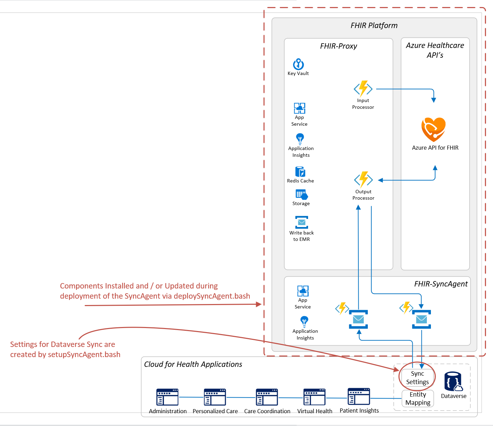

# Challenge 5 - FHIR SyncAgent

## Introduction

Welcome to Challenge 5!

In this challenge you will learn how to download and install the Microsoft Cloud for Health FHIR-SyncAgent. 

## Background
Microsoft's Cloud for Healthcare data store is **Azure API for FHIR**, while leveraging the **Dynamics** industry data model for health in **Dataverse**. Leveraging Dataverse enables you to quickly stand up Power Apps for your organization's unique needs. The FHIR-SyncAgent is a function app designed to keep data synchronized between the two data stores (Azure API for FHIR and Dataverse).  

Installing the FHIR-SyncAgent requires configuration in both Azure and Dynamics.  The Azure installation is accomplished using the Azure Cloud Shell - Bash Shell environment while the Dynamics work is carried out via Solution Center.  

## Learning Objectives
+ Install and Configure the FHIR-SyncAgent using the bash shell scripts 

## Prerequisites
+ Successful completion of Challenge 1 
+ Access the Private GitHub Repo holding the FHIR-SyncAgent
+ Use a Personnel Access Token to clone the repo
---

## Step 1 - Access the Private Github Repo (MSFT only)
Setting up a GitHub account using this reference:  https://docs.opensource.microsoft.com/tools/github/accounts/index.html

Join the Microsoft Organization requirements  
- Microsoft employee, intern, or vendor
- Must have a GitHub account with two-factor authentication (2FA) enabled
- Add your @microsoft.com email address to your GitHub account
- Professional GitHub profile appearance is requested for those who publicize their membership in the organization

Linking your Microsoft alias to your GitHub account
Go to the https://opensource.microsoft.com/link and, if you have a GitHub account, sign in. Otherwise, create a GitHub account and follow the steps. After signing in, you need to authorize the "Microsoft Open Source Repositories" application in GitHub. Once authorized, click Link to complete the process.

Join organizations
Joining Microsoft organizations is quick and simple. We do not manually send invites you must join through the portal. Go to https://repos.opensource.microsoft.com and click on the organization you want to join.

__Note__    
YOU MUST JOIN THE MICROSOFT ORGANIZATION TO ACCESS TO SMOKEJUMPERS PROJECTS


## Step 2 - Use a Personal Access Token to clone the repo (MSFT only)
To clone the private microsoft/fhir-cds-agent repo users must use a Private Access Token. GitHub instructions for creating a token can be found here https://docs.github.com/en/free-pro-team@latest/github/authenticating-to-github/creating-a-personal-access-token, or see examples below.

Note that because Microsoft uses SSO, you will have to authorize the token to work with SSO.
- Go to Account -> Settings -> Developer Settings -> Personal Access Tokens - Generate new token 

Cloning the Repo  
```
git clone https://github.com/microsoft/fhir-cds-agent 
Username for 'https://github.com': yourname@microsoft.com 
Password for 'https://yourname@microsoft.com@github.com': (use your Personal Access Token)
```
  
__Note__  
The `microsoft' organization has enforced SAML SSO. You must verify for you email address before you can clone the repo.  After SSO is verified and enabled you can download / clone the repo. 

## Step 3 - Install and Configure the FHIR-SyncAgent
The FHIR-Sync Agent scripts are designed for and tested from the Azure Cloud Shell - Bash Shell environment. The following services are required as part of the FHIR-SyncAgent -- detailed deployment instuctions are located in the **[Readme.md](https://github.com/microsoft/fhir-cds-agent/blob/main/scripts/Readme.md)** within the scripts directory.
+ Azure Active Directory
+ Azure Storage
+ Azure Service Bus
+ Azure Functions
+ Azure Key Vault
+ Azure Application Insights

The FHIR-SyncAgent depends on other Microsoft technologies, specifically
+ Azure API for FHIR
+ Micorosft Dynamics

### Deployment Overview  
Preview of the work each script completes 



## Challenge Success
+ Successful installation of the FHIR-SyncAgent

